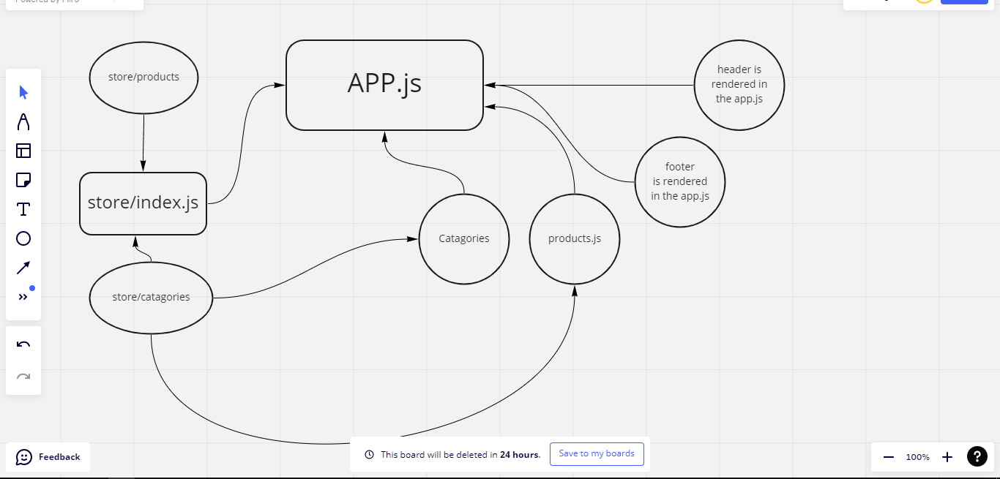

# Storefront 

## Lab 36 :  branch name : Redux finished and did the stretch goal
[Pull Request](https://github.com/Mohammed-Awadallah/storefront/pull/1)
> in this lab we begin the 4 phase process of creating a storefront app written in react using redux and material ui for styling 

**user stories**
* As a user, I expect to see a list of available product categories in the store so that I can easily browse products
* As a user, I want to choose a category and see a list of all available products matching that category
* As a user, I want a clean, easy to use user interface so that I can shop the online store with confidence

## Lab 37
> 

**user Stories**

## Lab 38

>

**user Stories**

## What helped me create this 

* [Material UI useStyles and makeStyles](https://smartdevpreneur.com/material-ui-makestyles-usestyles-createstyles-and-withstyles-explained/)
* [useSplash for random pics](https://source.unsplash.com/)
* [problem solving from StackFellows](https://stackoverflow.com/questions/60795368/react-hook-usestyles-is-called-in-function-which-is-neither-a-react-function-c)
* [reading about the connect function](https://react-redux.js.org/api/connect)
* [Dispatching Actions](https://react-redux.js.org/using-react-redux/connect-mapdispatch)
* [material UI for styling](https://mui.com/)
* [header component](https://betterprogramming.pub/building-a-basic-header-with-materialui-and-react-js-d650f75b4b0a)
* [footer component](https://www.js-tutorials.com/react-js/react-layout-using-material-design/)

## UML 

### lab 36

